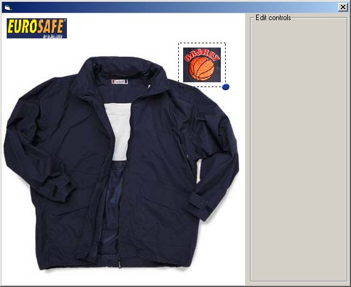



## \[\[ Move/resize/place image

### Description

To move and resize images. Could be used to place logos on clothing etc. I thing you will like it. Please vote or leave a comment if you do.
 
### More Info
 

             |
---                |---
**Submitted On**   |2000-11-26 12:08:00
**By**             |[Pamela RAI](https://github.com/Planet-Source-Code/PSCIndex/blob/master/ByAuthor/pamela-rai.md)
**Level**          |Intermediate
**User Rating**    |4.4 (22 globes from 5 users)
**Compatibility**  |VB 4\.0 \(32\-bit\), VB 5\.0, VB 6\.0
**Category**       |[Complete Applications](https://github.com/Planet-Source-Code/PSCIndex/blob/master/ByCategory/complete-applications__1-27.md)
**World**          |[Visual Basic](https://github.com/Planet-Source-Code/PSCIndex/blob/master/ByWorld/visual-basic.md)
**Archive File**   |[\[\[\_Move\_re152609182003\.zip](https://github.com/Planet-Source-Code/pamela-rai-move-resize-place-image__1-42278/archive/master.zip)

